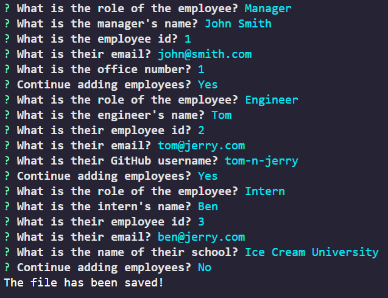

# Team Template Engine

# Description
Dynamically creates an html page containing information about a team of employees (manager, engineer, intern) which is gathered by the user from inquirer js CLI.

  

# Installation
npm i

# Usage
Run command node app.js in route directory.

# License
This work is licensed under the following:
* [MIT](https://opensource.org/licenses/MIT)

# Questions

[Click Here to Visit my GitHub](https://github.com/vivid-green)

Email me with questions: zacharycreek@gmail.com
